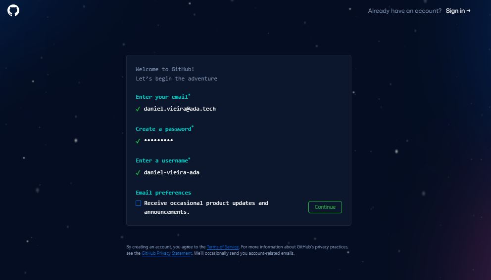
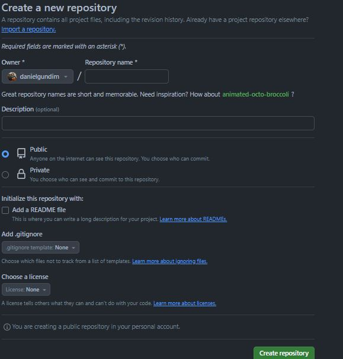
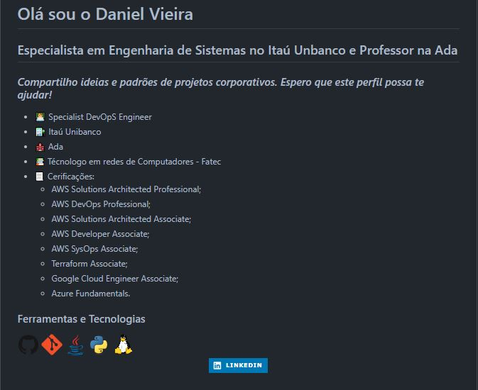
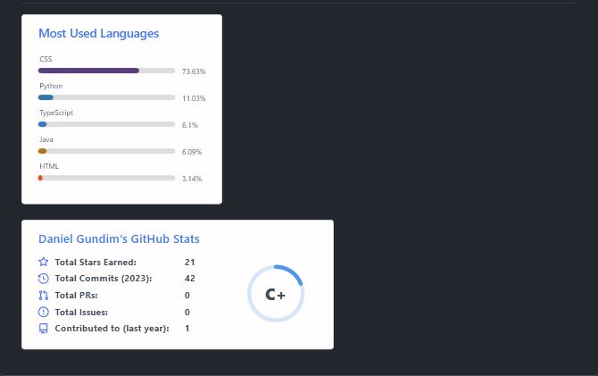

# **GitHub para empregabilidade**

**Objetivo**: Este curso é projetado para capacitar alunos, tanto experientes quanto iniciantes, a desenvolver um portfólio impactante no GitHub, uma ferramenta indispensável no universo de Tecnologia da Informação. Entendemos que, especialmente para quem está começando, uma das perguntas mais desafiadoras em entrevistas de emprego é sobre experiência prévia em projetos. Aqui, ensinaremos como construir um portfólio no GitHub que fala por si só, demonstrando não apenas os projetos em que você trabalhou, mas também seu comprometimento contínuo com o aprendizado e a aplicação prática de suas habilidades.

### Introdução ao Git e ao GitHub: Entendendo as Diferenças

**Git vs. GitHub:**

1. **Git**:
   - **Descrição**: Git é um sistema de controle de versão distribuído, criado para gerenciar o desenvolvimento de projetos de software de forma eficiente e confiável. Ele rastreia as mudanças no código ao longo do tempo, permitindo que múltiplos colaboradores trabalhem juntos sem perder a integridade do projeto.
   - **Utilização Prática**: Git é usado na linha de comando para gerenciar versões de um projeto.

2. **GitHub**:
   - **Descrição**: GitHub é uma plataforma de hospedagem de código baseada na web que utiliza o Git. Ela fornece uma interface gráfica do usuário para o Git, além de recursos adicionais como controle de acesso, rastreamento de bugs, solicitações de pull e revisões de código.
   - **Utilização Prática**: O GitHub é usado para armazenar repositórios Git na nuvem, facilitando a colaboração e compartilhamento de projetos com outros.

### Criando uma Conta no GitHub e Explorando a Interface

**Passo a Passo para Criar uma Conta no GitHub**:
1. Acesse [github.com](https://github.com) e clique em “Sign up”.

2. Preencha o formulário de cadastro.

3. Verifique seu e-mail para concluir o cadastro.

### Criando e Personalizando um Repositório

**Criar um Repositório no GitHub**:
1. Clique em “New repository” no menu de seu perfil.
2. Dê um nome ao seu repositório e adicione uma descrição breve.



**Repositório com Nome de Perfil**: 
- Um repositório com seu nome de usuário (ex: `username/username`) é ideal para introduzir quem você é e destacar suas habilidades e projetos.
- Este repositório permite que você crie um arquivo **README.md**, que será exibido automaticamente na página inicial do seu perfil do GitHub.

## Por Que Criar um Repositório com Nome de Perfil?

### Perfil Personalizado
   Ele oferece uma oportunidade única de personalizar seu perfil do GitHub. Ao contrário dos outros repositórios, que são específicos para projetos individuais, este README serve como uma introdução geral ao seu perfil completo.

### Destaque suas Habilidades e Projetos
Você pode usar esse README para destacar suas habilidades, experiências, projetos importantes e qualquer outra informação que você acredita que possa chamar a atenção de visitantes, colaboradores ou potenciais empregadores.

### Aumento de Visibilidade
Dado que este README é exibido na sua página de perfil do GitHub, ele é uma das primeiras coisas que as pessoas verão ao visitar seu perfil. Isso aumenta a visibilidade das informações mais importantes sobre você e seu trabalho.

### Profissionalismo e Criatividade
Mostra profissionalismo e atenção aos detalhes. Também é uma oportunidade de ser criativo com a apresentação, usando formatação Markdown, imagens, links, badges, etc.

### Facilidade de Acesso
Torna mais fácil para os visitantes obterem uma visão geral rápida de quem você é e do que você faz, sem ter que navegar por vários projetos e repositórios.

### Exemplo de Uso do Git e GitHub
Demonstra sua habilidade em usar as funcionalidades do GitHub, indicando um bom entendimento da plataforma.

### Editando o README.md

**Como Editar o README.md**:
- Utilize Markdown para formatar o texto, adicionar imagens, links e tudo o que for relevante para apresentar você e seus projetos.

**Dicas para um README Atrativo**:
1. **Introdução Pessoal**: Inclua uma breve introdução sobre quem você é.
2. **Projetos em Destaque**: Liste seus projetos mais significativos.
3. **Habilidades e Tecnologias**: Destaque as tecnologias que você domina.
4. **Contato**: Forneça maneiras de entrar em contato com você.


- De forma prática vamos detalhar a construção do README abaixo e abordar cada detalhe.






# Detalhamento do README

## Cabeçalho Principal
```markdown
# Olá sou o **Daniel Vieira**
```
- **Função**: Apresenta o nome do proprietário do perfil de maneira amigável e pessoal.
- **Estilo**: Uso de negrito para destacar o nome, tornando-o imediatamente visível.

## Subtítulo com a Profissão
```markdown
## Especialista em Engenharia de Sistemas no Itaú Unbanco e Professor na Ada 
```
- **Função**: Fornece informações sobre a ocupação profissional e o papel educacional do perfil.
- **Estilo**: Utiliza um tamanho de fonte menor que o cabeçalho principal, mas ainda significativo para mostrar a relevância profissional.

## Descrição Motivacional
```markdown
### *Compartilho ideias e padrões de projetos corporativos. Espero que este perfil possa te ajudar!*
```
- **Função**: Estabelece o propósito do perfil, indicando que o usuário compartilha conhecimento e experiência.
- **Estilo**: Uso de itálico para uma abordagem mais pessoal e direta.

## Lista de Qualificações e Experiências
```markdown
- 👨‍💻 Specialist DevOpS Engineer
- 🏦 Itaú Unibanco
- 🏫 Ada
- 📚 Técnologo em redes de Computadores - Fatec
- 📃 Cerificações:
    - AWS Solutions Architected Professional;
    - ... (e outras certificações)
```
- **Função**: Lista as posições profissionais, educação e certificações, destacando a expertise e a formação.
- **Estilo**: Uso de emojis para adicionar um elemento visual e tornar a leitura mais agradável.

## Ferramentas e Tecnologias
```html
<div>
    
    
    
    
    
</div>
```
- **Função**: Mostra as ferramentas e tecnologias com as quais o usuário está familiarizado.
- **Estilo**: Uso de ícones para representação visual das tecnologias, facilitando a identificação rápida.

## Links para Redes Sociais e Contato
```html
<div align="center"> 
  <a href="https://www.linkedin.com/in/daniel-vieira-9a9680127/" target="_blank"></a> 
</div>
```
- **Função**: Fornece um meio direto de contato através do LinkedIn.
- **Estilo**: Alinhamento central e uso de badge do LinkedIn para um apelo visual forte.

## Estatísticas do GitHub
```markdown
[](https://github.com/danielgundim/github-readme-stats)

  
```
- **Função**: Exibe estatísticas do GitHub, como linguagens mais usadas e status do perfil.
- **Estilo**: Uso de gráficos gerados automaticamente para fornecer uma visão rápida das atividades do usuário no GitHub.

# Conclusão

Este README é um modelo de como informações profissionais e pessoais podem ser combinadas para criar um perfil no GitHub que não apenas mostra habilidades técnicas, mas também apresenta a personalidade e os interesses do usuário. É um ótimo exemplo de como usar elementos visuais, como ícones e badges, junto com texto bem estruturado para criar um perfil atraente e informativo.
